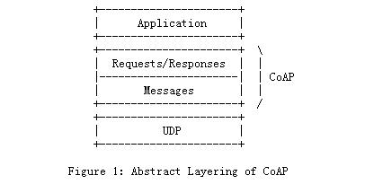

# [CoAP](https://github.com/qitas/CoAP) 

#### qitas@qitas.cn

CoAP(Constrained Application Protocol)针对只有少量的内存空间和有限的计算能力的物联网，是6LowPAN协议栈中的应用层协议，详细规范定义在 RFC 7252。

* [维基百科描述](http://en.wikipedia.org/wiki/Constrained_Application_Protocol) 

CoAP协议基于REST构架，为了克服HTTP对于受限环境的劣势，CoAP重新设计了HTTP的部分功能以适应设备的约束条件。另外，为了使协议适应物联网和M2M应用，CoAP协议改进了一些机制，同时增加了一些功能。

* CoAP是二进制格式的，HTTP是文本格式的，COAP比HTTP更加紧凑。
* 轻量化，COAP最小长度仅仅4B，一个HTTP的头都几十Bytes。
* 基于轻量级的UDP协议，支持可靠传输，数据重传，块传输,支持IP多播。
* 非长连接通信，适用于低功耗物联网场景。

为了弥补UDP传输的不可靠性，CoAP定义了带有重传机制的事务处理机制。并且提供资源发现机制，并带有资源描述。CoAP协议采用了双层的结构。事务层(Transaction layer)处理节点间的信息交换，同时，也提供对多播和拥塞控制的支持。请求/响应层(Request/Response layer)用以传输对资源进行操作的请求和相应信息。

#### COAP协议消息类型

CON — 需要被确认的请求，如果CON请求被发送，那么对方必须做出响应。这有点像TCP，对方必须给确认收到消息，用以可靠消息传输。

NON — 不需要被确认的请求，如果NON请求被发送，那么对方不必做出回应。这适用于消息会重复频繁的发送，丢包不影响正常操作。这个和UDP很像。用以不可靠消息传输。

ACK — 应答消息，对应的是CON消息的应答。

RST — 复位消息，可靠传输时候接收的消息不认识或错误时，不能回ACK消息，必须回RST消息。

#### 消息头信息（HEAD）

第一行是消息头，固定4Bytes(32bits)。

* Ver : 2bit， 版本信息，当前是必须写0x01
* T： 2bit， 消息类型，包括 CON, NON. ACK, RST这4种
* TKL: 4bit，token长度， 当前支持0~8B长度，其他长度保留将来扩展用
* Code：8bit，分成前3bit（0~7）和后5bit（0~31），前3bit代表类型
* Message ID：16bit， 代表消息MID，每个消息都有一个ID ，重发的消息不变

### [NB方案](NB/)

#### [BC26实现](NB/)

## 锻造最美之器